# GUIDE — K3 Ngày 12: Hạ Tầng Cloud & Deployment

> Hướng dẫn này được xây dựng dựa trên repository:
> `https://github.com/lemanhcuong6904/K3-Day12-2A202601137-LeManhCuong`
>
> Mục tiêu của tài liệu là giúp bạn hiểu **kiến trúc**, **luồng xử lý**, **ý nghĩa kỹ thuật** và **thứ tự triển khai** để hoàn thành toàn bộ CP0 → CP5 và phần BONUS của bài lab.

---

## 0. Cảnh báo cần xử lý trước khi làm bài

Repository hiện tại có tên:

```text
K3-Day12-2A202601137-LeManhCuong
```

Trong `README.md`, bài lab yêu cầu tên repo theo mẫu:

```text
DAY12-<Mã học viên>-<Họ và Tên>
```

Với mã học viên hiện tại, tên nên là:

```text
DAY12-2A202601137-LeManhCuong
```

README cũng ghi rõ **sai tên repo bị trừ 5 điểm**.

### Cách sửa

Trên GitHub:

```text
Repository
→ Settings
→ General
→ Repository name
→ DAY12-2A202601137-LeManhCuong
```

Sau đó ở máy local nên cập nhật remote:

```bash
git remote -v
git remote set-url origin https://github.com/lemanhcuong6904/DAY12-2A202601137-LeManhCuong.git
git remote -v
```

---

# 1. Bài lab này đang xây dựng cái gì?

Bài lab bắt đầu từ một FastAPI AI Agent chạy trên máy local và từng bước biến nó thành một service có thể chạy gần với môi trường production.

Ứng dụng cuối cùng phải có:

- cấu hình qua biến môi trường theo tư tưởng 12-Factor;
- API key authentication;
- rate limiting;
- cost guard;
- Redis lưu state;
- structured logging dạng JSON;
- `/health` và `/ready`;
- graceful shutdown;
- Docker multi-stage;
- container không chạy bằng root;
- Docker Compose cho Agent + Redis;
- khả năng scale nhiều instance;
- public deployment trên Railway/Render hoặc nền tảng tương đương;
- BONUS: CI/CD bằng GitHub Actions.

Mock LLM đã được cung cấp sẵn nên **không cần OpenAI API key**.

---

# 2. Các checkpoint và điểm số

| Checkpoint | Nội dung | File chính | Điểm |
|---|---|---|---:|
| CP0 | Setup môi trường | môi trường local | — |
| CP1 | 12-Factor Config, Health, Logging | `config.py`, `logging_utils.py`, `main.py` | 15 |
| CP2 | Docker production-ready | `Dockerfile`, `.dockerignore`, `docker-compose.yml` | 15 |
| CP3 | Authentication, Rate Limit, Cost Guard | `auth.py`, `rate_limiter.py`, `cost_guard.py`, `main.py` | 20 |
| CP4 | Stateless, Readiness, Graceful Shutdown | `store.py`, `lifecycle.py`, `main.py` | 20 |
| CP5 | Deploy cloud thật | `DEPLOYMENT.md` | 15 |
| Exercises | 10 câu phản ánh | `exercises.md` | 15 |
| BONUS | GitHub Actions CI/CD | `.github/workflows/ci.yml` | +10 |

Lệnh kiểm tra tổng:

```bash
python grade.py
```

Chỉ phần bắt buộc:

```bash
python grade.py --no-bonus
```

---

# 3. Kiến trúc tổng thể

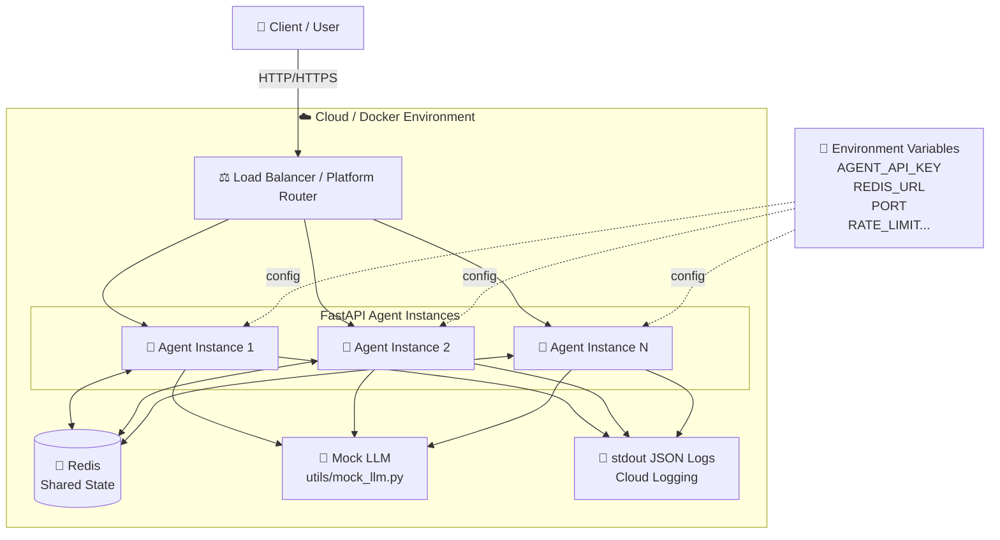

Điểm quan trọng nhất của kiến trúc là:

```text
Agent instance = stateless
State = Redis
Config = Environment Variables
Logs = stdout
```

Nhờ đó có thể chạy một hoặc nhiều container mà không làm mất lịch sử hội thoại.

---

# 4. Kiến trúc theo module trong source code

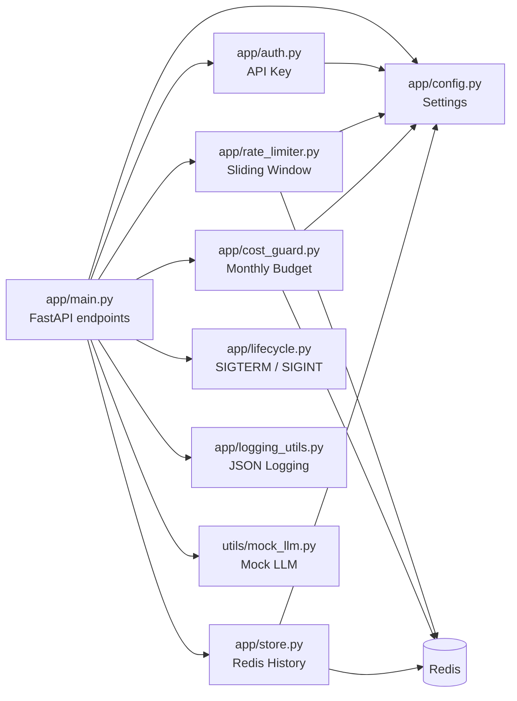

---

# 5. Luồng xử lý request `/ask`

Đây là luồng quan trọng nhất của toàn bộ lab.

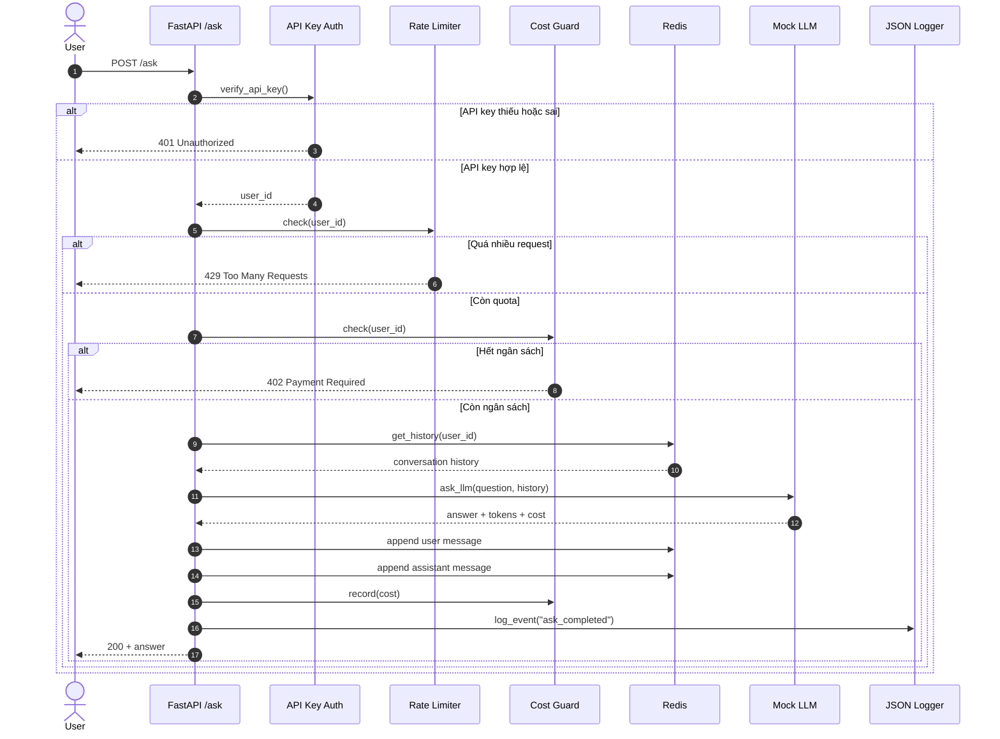

Thứ tự phải là:

```text
Authentication
    ↓
Rate Limit
    ↓
Cost Guard
    ↓
Read History
    ↓
Call LLM
    ↓
Persist History
    ↓
Record Cost
    ↓
Structured Log
    ↓
Response
```

Không được gọi LLM trước rate limit/cost guard vì khi đó request bị chặn **sau khi đã phát sinh chi phí**.

---

# 6. Phân biệt `/health` và `/ready`

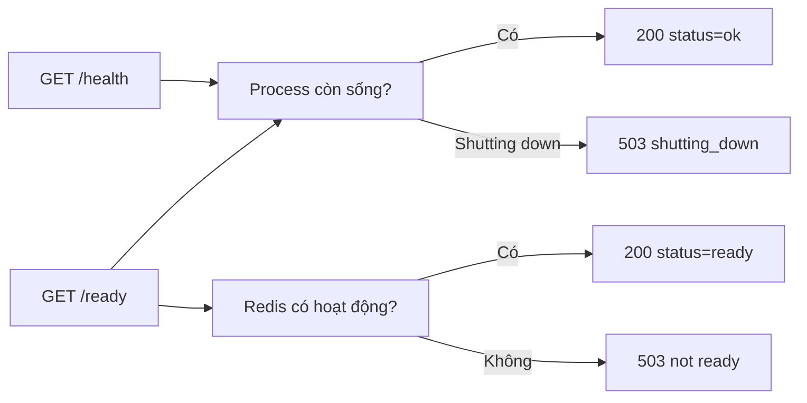

| Endpoint | Loại probe | Kiểm tra Redis? | Ý nghĩa |
|---|---|---:|---|
| `/health` | Liveness | Không | Process có còn sống không? |
| `/ready` | Readiness | Có | Instance có sẵn sàng nhận traffic không? |

Không nên biến `/health` thành endpoint kiểm tra Redis. Nếu Redis lỗi tạm thời và `/health` cũng trả lỗi, orchestrator có thể restart tất cả application instance trong khi bản thân process vẫn hoàn toàn khỏe.

---

# 7. CP0 — Setup môi trường

## 7.1 Clone/fork repo

Sau khi sửa đúng tên repository:

```bash
git clone https://github.com/lemanhcuong6904/DAY12-2A202601137-LeManhCuong.git
cd DAY12-2A202601137-LeManhCuong
```

---

## 7.2 Tạo virtual environment

### Windows PowerShell

```powershell
python -m venv .venv
.venv\Scripts\Activate.ps1
python -m pip install -r requirements.txt
```

### Linux/macOS

```bash
python3 -m venv .venv
source .venv/bin/activate
python -m pip install -r requirements.txt
```

Kiểm tra:

```bash
python --version
python -m pip check
```

Lab yêu cầu Python 3.11+.

---

## 7.3 Tạo `.env`

Windows:

```powershell
Copy-Item .env.example .env
```

Linux/macOS:

```bash
cp .env.example .env
```

Sinh API key:

```bash
python -c "import secrets; print(secrets.token_urlsafe(32))"
```

Điền vào `.env`:

```dotenv
PORT=8000
AGENT_API_KEY=<khóa-vừa-sinh>
REDIS_URL=redis://localhost:6379/0
RATE_LIMIT_PER_MINUTE=10
MONTHLY_BUDGET_USD=10.0
LOG_LEVEL=INFO

LOCAL_FALLBACK=false
DEPLOY_API_KEY=
```

**Không commit `.env`.**

Kiểm tra:

```bash
git status
git ls-files | grep "^\.env$"
```

PowerShell:

```powershell
git ls-files | Select-String "^\.env$"
```

Kết quả không được có file `.env`.

---

## 7.4 Chạy Redis

```bash
docker compose up -d redis
docker compose ps
```

Nếu chưa dùng được Docker:

```dotenv
REDIS_URL=fake://
```

`fake://` dùng `fakeredis` trong RAM, chỉ nên dùng để làm CP1/CP3/CP4 tạm thời.

---

## 7.5 Checkpoint 0

```bash
pytest tests/ -v -m "not docker"
```

Ở thời điểm này nhiều test rớt là bình thường. Điều cần xác nhận là:

- pytest chạy được;
- không có `ModuleNotFoundError`;
- không có lỗi virtual environment;
- test được discover đúng.

Commit:

```bash
git add .
git commit -m "Checkpoint 0 - setup environment"
git push
```

---

# 8. CP1 — 12-Factor Config, Health và Structured Logging

File cần sửa:

```text
app/config.py
app/logging_utils.py
app/main.py
```

---

## 8.1 `app/config.py`

Mục tiêu: toàn bộ config thay đổi giữa local/staging/production phải đến từ biến môi trường.

### Sáu field bắt buộc

```python
port: int = 8000
agent_api_key: str
redis_url: str = "redis://localhost:6379/0"
rate_limit_per_minute: int = 10
monthly_budget_usd: float = 10.0
log_level: str = "INFO"
```

`agent_api_key` **không có default**.

Phần class nên có dạng:

```python
class Settings(BaseSettings):
    model_config = SettingsConfigDict(
        env_file=".env",
        env_file_encoding="utf-8",
        extra="ignore",
    )

    port: int = 8000
    agent_api_key: str
    redis_url: str = "redis://localhost:6379/0"
    rate_limit_per_minute: int = 10
    monthly_budget_usd: float = 10.0
    log_level: str = "INFO"
```

### Vì sao secret không có default?

Nếu viết:

```python
agent_api_key: str = "changeme"
```

thì production vẫn boot thành công khi bạn quên set secret.

Ngược lại:

```python
agent_api_key: str
```

khi thiếu `AGENT_API_KEY` thì Pydantic ném `ValidationError` ngay khi khởi động.

Đó là **fail fast**.

---

## 8.2 `app/logging_utils.py`

Yêu cầu:

- log phải là JSON hợp lệ;
- mỗi event chỉ chiếm đúng một dòng;
- có `event`;
- có `level`;
- có `timestamp`;
- thêm được arbitrary fields;
- `level` phải lowercase;
- hỗ trợ Unicode tiếng Việt.

Cài đặt:

```python
def log_event(event: str, level: str = "info", **fields) -> str:
    payload = {
        "event": event,
        "level": level.lower(),
        "timestamp": utc_now_iso(),
        **fields,
    }

    raw = json.dumps(payload, ensure_ascii=False)
    print(raw, file=sys.stdout, flush=True)
    return raw
```

Ví dụ output:

```json
{"event":"ask_completed","level":"info","timestamp":"2026-08-10T03:30:00+00:00","user_id":"sv01","cost_usd":0.0001}
```

Không dùng:

```python
json.dumps(payload, indent=2)
```

vì log sẽ bị tách thành nhiều dòng.

---

## 8.3 `/health` trong `app/main.py`

Cài đặt:

```python
@app.get("/health")
def health():
    if lifecycle.shutting_down:
        return JSONResponse(
            status_code=503,
            content={"status": "shutting_down"},
        )

    return {
        "status": "ok",
        "service": SERVICE_NAME,
        "version": SERVICE_VERSION,
    }
```

Điểm bắt buộc:

```text
/health KHÔNG Depends(get_store)
/health KHÔNG ping Redis
/health KHÔNG query database
```

---

## 8.4 Chạy app local

```bash
uvicorn app.main:app --reload --port 8000
```

Terminal khác:

```bash
curl -i http://localhost:8000/health
```

Kỳ vọng:

```http
HTTP/1.1 200 OK
```

Body:

```json
{
  "status": "ok",
  "service": "day12-agent",
  "version": "1.0.0"
}
```

---

## 8.5 Checkpoint 1

```bash
pytest tests/test_cp1.py -v
```

Nếu lỗi đầu tiên khó đọc:

```bash
pytest tests/test_cp1.py -x --tb=short
```

### Checklist CP1

- [ ] đủ 6 settings;
- [ ] `AGENT_API_KEY` bắt buộc;
- [ ] không hardcode secret;
- [ ] env override được default;
- [ ] JSON log hợp lệ;
- [ ] log đúng một dòng;
- [ ] Unicode tiếng Việt không bị escape khó đọc;
- [ ] `/health` trả 200;
- [ ] `/health` không phụ thuộc Redis.

Commit:

```bash
git add app/
git commit -m "Checkpoint 1 - config health structured logging"
git push
```

---

# 9. CP2 — Docker production-ready

File:

```text
Dockerfile
.dockerignore
docker-compose.yml
```

---

# 9.1 Kiến trúc Docker

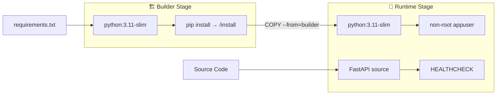

Builder có thể chứa tool build. Runtime chỉ giữ thứ cần chạy app.

---

## 9.2 Dockerfile đề xuất

```dockerfile
FROM python:3.11-slim AS builder

WORKDIR /build

COPY requirements.txt .

RUN pip install \
    --no-cache-dir \
    --prefix=/install \
    -r requirements.txt


FROM python:3.11-slim AS runtime

ENV PYTHONDONTWRITEBYTECODE=1 \
    PYTHONUNBUFFERED=1

WORKDIR /app

RUN useradd --create-home --uid 10001 appuser

COPY --from=builder /install /usr/local

COPY app ./app
COPY utils ./utils

EXPOSE 8000

HEALTHCHECK --interval=30s --timeout=5s --retries=3 \
    CMD python -c "import urllib.request; urllib.request.urlopen('http://127.0.0.1:8000/health').read()" || exit 1

USER appuser

CMD ["sh", "-c", "uvicorn app.main:app --host 0.0.0.0 --port ${PORT:-8000}"]
```

### Tại sao `requirements.txt` phải copy trước source?

Docker cache theo layer.

Nên:

```dockerfile
COPY requirements.txt .
RUN pip install ...
COPY app ./app
```

Khi sửa `app/main.py`, layer cài dependency vẫn được cache.

Không nên:

```dockerfile
COPY . .
RUN pip install ...
```

vì mỗi lần source thay đổi, `pip install` phải chạy lại.

---

## 9.3 Không chạy container bằng root

Dòng quan trọng:

```dockerfile
RUN useradd --create-home --uid 10001 appuser
USER appuser
```

Kiểm tra sau khi build:

```bash
docker run --rm day12-agent:prod id
```

UID không nên là `0`.

---

## 9.4 `.dockerignore`

Tối thiểu:

```dockerignore
.git
.gitignore
.env
.venv
__pycache__
*.pyc
.pytest_cache
tests
screenshots
```

Điểm bắt buộc nhất là:

```text
.env
.git
.venv
__pycache__
```

**Không ignore:**

```text
app/
utils/
requirements.txt
```

nếu Dockerfile còn cần chúng.

---

## 9.5 `docker-compose.yml`

Thêm service `agent`:

```yaml
services:
  redis:
    image: redis:7-alpine
    command: ["redis-server", "--appendonly", "yes"]
    ports:
      - "6379:6379"
    volumes:
      - redis-data:/data
    healthcheck:
      test: ["CMD", "redis-cli", "ping"]
      interval: 10s
      timeout: 3s
      retries: 5

  agent:
    build: .
    ports:
      - "8000:8000"
    environment:
      AGENT_API_KEY: ${AGENT_API_KEY}
      REDIS_URL: redis://redis:6379/0
      RATE_LIMIT_PER_MINUTE: ${RATE_LIMIT_PER_MINUTE:-10}
      MONTHLY_BUDGET_USD: ${MONTHLY_BUDGET_USD:-10.0}
      LOG_LEVEL: ${LOG_LEVEL:-INFO}
      PORT: 8000
    depends_on:
      redis:
        condition: service_healthy
    healthcheck:
      test:
        [
          "CMD",
          "python",
          "-c",
          "import urllib.request; urllib.request.urlopen('http://127.0.0.1:8000/health').read()"
        ]
      interval: 30s
      timeout: 5s
      retries: 3

volumes:
  redis-data:
```

### Vì sao `REDIS_URL` không phải localhost?

Sai:

```yaml
REDIS_URL: redis://localhost:6379/0
```

Trong container Agent:

```text
localhost = chính container Agent
```

Đúng:

```yaml
REDIS_URL: redis://redis:6379/0
```

vì Docker Compose có DNS nội bộ và tên service `redis` trở thành hostname.

---

## 9.6 Build và kiểm tra

```bash
docker build -t day12-agent:prod .
docker images day12-agent:prod
```

Mục tiêu bài lab: image dưới khoảng 500 MB.

Chạy stack:

```bash
docker compose up -d
docker compose ps
```

Test:

```bash
curl http://localhost:8000/health
```

Log:

```bash
docker compose logs agent
```

Theo dõi liên tục:

```bash
docker compose logs -f agent
```

---

## 9.7 Checkpoint 2

Nhanh, không build Docker thật:

```bash
pytest tests/test_cp2.py -v -m "not docker"
```

Đầy đủ:

```bash
pytest tests/test_cp2.py -v
```

### Checklist CP2

- [ ] multi-stage >= 2 `FROM`;
- [ ] stage có tên `AS builder`;
- [ ] base image `slim` hoặc `alpine`;
- [ ] dependency cài trước source;
- [ ] có `USER` và không phải root;
- [ ] có `HEALTHCHECK`;
- [ ] app bind `0.0.0.0`;
- [ ] port đọc từ `$PORT`;
- [ ] `.env` nằm trong `.dockerignore`;
- [ ] Compose có `agent`;
- [ ] `AGENT_API_KEY` qua variable interpolation;
- [ ] `REDIS_URL=redis://redis:6379/0`;
- [ ] `depends_on: redis`.

Commit:

```bash
git add Dockerfile .dockerignore docker-compose.yml
git commit -m "Checkpoint 2 - production Docker setup"
git push
```

---

# 10. CP3 — API Security

CP3 gồm ba lớp độc lập:

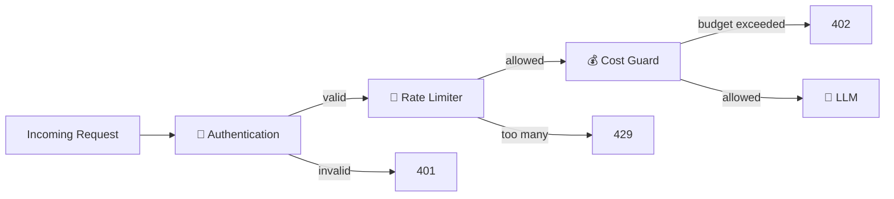

---

# 10.1 `app/auth.py`

Cài đặt:

```python
def verify_api_key(
    x_api_key: str | None = Header(default=None),
    x_user_id: str | None = Header(default=None),
) -> str:
    correct_key = get_settings().agent_api_key

    if x_api_key is None or not secrets.compare_digest(x_api_key, correct_key):
        raise HTTPException(
            status_code=status.HTTP_401_UNAUTHORIZED,
            detail="invalid or missing API key",
        )

    return x_user_id or ANONYMOUS_USER
```

Không dùng:

```python
x_api_key == correct_key
```

Bài test kiểm tra source thật sự có gọi `compare_digest()`.

---

# 10.2 `app/rate_limiter.py`

Redis Sorted Set:

```text
key    = ratelimit:<user_id>
member = unique request id
score  = timestamp
```

Luồng:

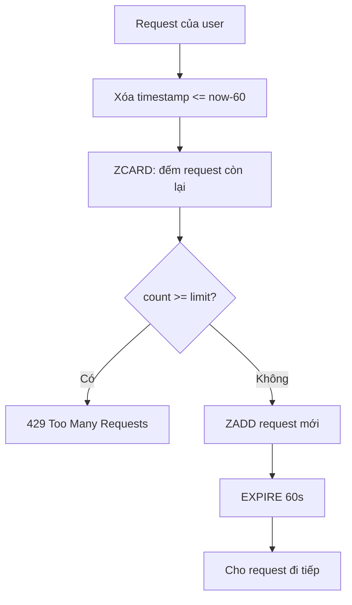

Cài đặt `hit_count()`:

```python
def hit_count(self, user_id: str, now: float | None = None) -> int:
    now = now if now is not None else time.time()
    key = self._key(user_id)

    self.client.zremrangebyscore(
        key,
        0,
        now - WINDOW_SECONDS,
    )

    return int(self.client.zcard(key))
```

Cài đặt `check()`:

```python
def check(self, user_id: str, now: float | None = None) -> None:
    now = now if now is not None else time.time()

    count = self.hit_count(user_id, now)

    if count >= self.limit:
        raise HTTPException(
            status_code=status.HTTP_429_TOO_MANY_REQUESTS,
            detail="rate limit exceeded",
            headers={"Retry-After": str(WINDOW_SECONDS)},
        )

    key = self._key(user_id)

    self.client.zadd(
        key,
        {f"{now}:{uuid.uuid4().hex}": now},
    )

    self.client.expire(key, WINDOW_SECONDS)
```

Cực kỳ chú ý:

```text
CHECK trước
ZADD sau
```

Nếu add trước rồi đếm, request thứ đúng bằng `limit` có thể bị chặn sai.

---

# 10.3 `app/cost_guard.py`

Redis key:

```text
cost:<user_id>:<YYYY-MM>
```

Ví dụ:

```text
cost:sv01:2026-08
```

### `spent()`

```python
def spent(self, user_id: str, month: str | None = None) -> float:
    value = self.client.get(self._key(user_id, month))

    if value is None:
        return 0.0

    return float(value)
```

### `check()`

```python
def check(
    self,
    user_id: str,
    estimated_cost: float = 0.0,
    month: str | None = None,
) -> None:
    if self.spent(user_id, month) + estimated_cost > self.budget:
        raise HTTPException(
            status_code=status.HTTP_402_PAYMENT_REQUIRED,
            detail="monthly budget exceeded",
        )
```

### `record()`

```python
def record(
    self,
    user_id: str,
    cost: float,
    month: str | None = None,
) -> float:
    key = self._key(user_id, month)

    total = self.client.incrbyfloat(key, cost)
    self.client.expire(key, KEY_TTL_SECONDS)

    return float(total)
```

---

# 10.4 Hoàn thiện `/ask`

Cài đúng thứ tự:

```python
@app.post("/ask")
def ask(
    payload: AskRequest,
    user_id: str = Depends(verify_api_key),
    store: ConversationStore = Depends(get_store),
    limiter: RateLimiter = Depends(get_rate_limiter),
    guard: CostGuard = Depends(get_cost_guard),
):
    limiter.check(user_id)

    guard.check(user_id)

    history = store.get_history(user_id)

    result = ask_llm(
        payload.question,
        history,
    )

    store.append(
        user_id,
        "user",
        payload.question,
    )

    store.append(
        user_id,
        "assistant",
        result["answer"],
    )

    guard.record(
        user_id,
        result["cost_usd"],
    )

    log_event(
        "ask_completed",
        user_id=user_id,
        tokens_in=result["tokens_in"],
        tokens_out=result["tokens_out"],
        cost_usd=result["cost_usd"],
    )

    return {
        "answer": result["answer"],
        "user_id": user_id,
        "history_length": len(history),
        "cost_usd": result["cost_usd"],
        "tokens": {
            "in": result["tokens_in"],
            "out": result["tokens_out"],
        },
    }
```

`history_length` là độ dài **trước lượt hiện tại**.

Ví dụ:

```text
request 1 → history_length = 0
```

Sau đó Redis có:

```text
user
assistant
```

Nên:

```text
request 2 → history_length = 2
```

---

# 10.5 Test API

## Không API key

```bash
curl -i -X POST http://localhost:8000/ask \
  -H "Content-Type: application/json" \
  -d '{"question":"Hello"}'
```

Kỳ vọng:

```text
401
```

## Có API key

Linux/macOS:

```bash
export AGENT_API_KEY="<key>"
```

PowerShell:

```powershell
$env:AGENT_API_KEY="<key>"
```

Sau đó:

```bash
curl -i -X POST http://localhost:8000/ask \
  -H "Content-Type: application/json" \
  -H "X-API-Key: $AGENT_API_KEY" \
  -H "X-User-Id: sv01" \
  -d '{"question":"Docker là gì?"}'
```

PowerShell nên dùng:

```powershell
$headers = @{
    "X-API-Key" = $env:AGENT_API_KEY
    "X-User-Id" = "sv01"
}

Invoke-RestMethod `
    -Uri "http://localhost:8000/ask" `
    -Method Post `
    -Headers $headers `
    -ContentType "application/json" `
    -Body '{"question":"Docker là gì?"}'
```

---

# 10.6 Checkpoint 3

```bash
pytest tests/test_cp3.py -v
```

Chỉ test rate:

```bash
pytest tests/test_cp3.py -v -k rate
```

Chỉ lỗi đầu tiên:

```bash
pytest tests/test_cp3.py -x --tb=short
```

### Checklist CP3

- [ ] không key → 401;
- [ ] sai key → 401;
- [ ] đúng key → 200;
- [ ] không có `X-User-Id` → anonymous;
- [ ] dùng `secrets.compare_digest`;
- [ ] sliding window đúng 60 giây;
- [ ] mỗi user rate limit riêng;
- [ ] vượt rate → 429;
- [ ] cost chưa có → `0.0`;
- [ ] cost cộng dồn được;
- [ ] mỗi user budget riêng;
- [ ] vượt budget → 402;
- [ ] `/ask` gọi `guard.record()`;
- [ ] question rỗng → 422.

Commit:

```bash
git add app/
git commit -m "Checkpoint 3 - authentication rate limiting cost guard"
git push
```

---

# 11. CP4 — Scaling & Reliability

Mục tiêu CP4:

```text
State ra khỏi process
+
Readiness probe
+
Graceful shutdown
=
service có thể scale/redeploy an toàn hơn
```

---

# 11.1 Vì sao service phải stateless?

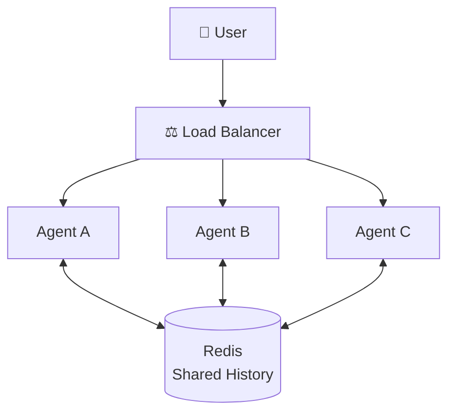

Nếu history lưu bằng:

```python
conversation_history = {}
```

thì mỗi container có một copy khác nhau.

Request đầu vào A, request sau vào B:

```text
A biết lịch sử
B không biết lịch sử
```

Redis giải quyết vấn đề này vì mọi instance dùng chung một datastore.

---

# 11.2 `app/store.py`

## `ping()`

```python
def ping(self) -> bool:
    try:
        return bool(self.client.ping())
    except Exception:
        return False
```

Không được để exception Redis thoát ra `/ready`.

---

## `append()`

```python
def append(self, user_id: str, role: str, content: str) -> None:
    key = self._key(user_id)

    self.client.rpush(
        key,
        json.dumps(
            {
                "role": role,
                "content": content,
            },
            ensure_ascii=False,
        ),
    )

    self.client.ltrim(
        key,
        -HISTORY_MAX_MESSAGES,
        -1,
    )

    self.client.expire(
        key,
        HISTORY_TTL_SECONDS,
    )
```

Tại sao:

```python
ltrim(key, -N, -1)
```

vì cần giữ **N message mới nhất**.

Không dùng:

```python
ltrim(key, 0, N - 1)
```

vì sẽ giữ phần cũ nhất.

---

## `get_history()`

```python
def get_history(self, user_id: str) -> list[dict]:
    key = self._key(user_id)

    rows = self.client.lrange(
        key,
        0,
        -1,
    )

    return [
        json.loads(row)
        for row in rows
    ]
```

Nếu key chưa tồn tại, Redis trả list rỗng nên kết quả là:

```python
[]
```

---

# 11.3 `/ready`

```python
@app.get("/ready")
def ready(store: ConversationStore = Depends(get_store)):
    if lifecycle.shutting_down:
        return JSONResponse(
            status_code=503,
            content={"status": "shutting_down"},
        )

    if not store.ping():
        return JSONResponse(
            status_code=503,
            content={
                "status": "not ready",
                "redis": False,
            },
        )

    return {
        "status": "ready",
        "redis": True,
    }
```

---

# 11.4 `app/lifecycle.py`

## Kiến trúc graceful shutdown

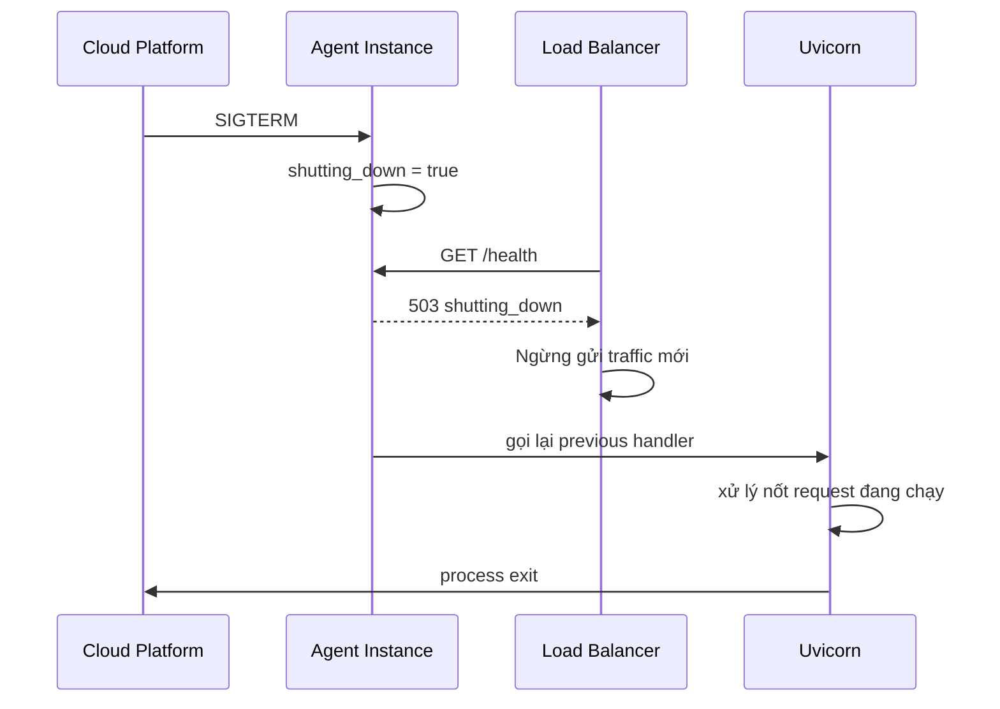

## `request_shutdown()`

```python
def request_shutdown(self, signum=None, frame=None) -> None:
    self.shutting_down = True

    previous = self._previous.get(signum)

    if callable(previous):
        previous(signum, frame)
```

## `install()`

```python
def install(self) -> None:
    for sig in (
        signal.SIGTERM,
        signal.SIGINT,
    ):
        self._previous[sig] = signal.getsignal(sig)
        signal.signal(sig, self.request_shutdown)
```

Điểm dễ sai:

Sai:

```python
signal.signal(sig, self.request_shutdown())
```

Đúng:

```python
signal.signal(sig, self.request_shutdown)
```

Ta truyền **function reference**, không gọi hàm ngay.

---

# 11.5 Trạng thái endpoint khi shutdown

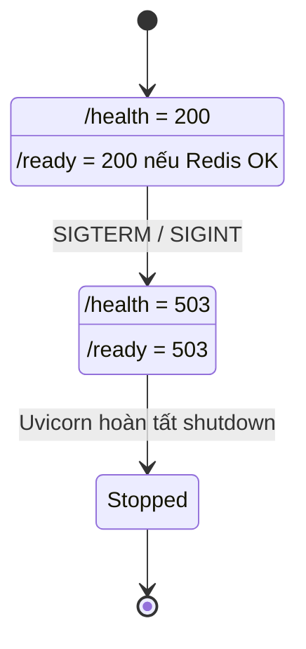

---

# 11.6 Kiểm tra Redis trực tiếp

```bash
docker compose exec redis redis-cli KEYS '*'
```

History:

```bash
docker compose exec redis \
  redis-cli LRANGE history:sv01 0 -1
```

Cost:

```bash
docker compose exec redis \
  redis-cli GET cost:sv01:2026-08
```

Rate limit:

```bash
docker compose exec redis \
  redis-cli ZCARD ratelimit:sv01
```

---

# 11.7 Scale nhiều Agent instance

Theo ý tưởng của bài:

```bash
docker compose up -d --scale agent=3
```

Tuy nhiên, nếu `agent` đang map cố định:

```yaml
ports:
  - "8000:8000"
```

thì nhiều Docker Compose version sẽ không cho 3 container cùng chiếm host port `8000`.

Để demo scale thực sự, nên đi qua Nginx:

```text
Client → Nginx :80 → agent:8000 x N
```

Lúc đó có thể bỏ host-port cố định của `agent` và dùng:

```yaml
expose:
  - "8000"
```

rồi thêm Nginx ở cổng 80.

**Lưu ý:** khi chạy checkpoint CP2, hãy ưu tiên cấu trúc đúng tiêu chí test của lab. Phần scale/Nginx là minh họa CP4/điểm cộng.

---

# 11.8 Nginx load balancing

Repo đã có `nginx/nginx.conf`.

Kiến trúc:

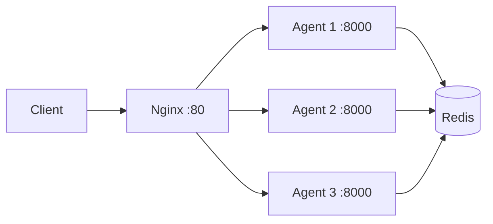

Điều cần chứng minh:

```text
request 1 → instance A
request 2 → instance B
```

nhưng `history_length` vẫn tăng đều vì history nằm trong Redis.

---

# 11.9 Checkpoint 4

```bash
pytest tests/test_cp4.py -v
```

Checklist:

- [ ] lưu/đọc history Redis;
- [ ] user khác nhau có history riêng;
- [ ] giữ tối đa 20 messages;
- [ ] giữ messages mới nhất;
- [ ] history có TTL;
- [ ] `ping()` trả False thay vì ném lỗi;
- [ ] không có global dict/list giữ conversation state;
- [ ] request thứ 2 nhìn thấy 2 messages của request thứ 1;
- [ ] `/ready` 200 nếu Redis sống;
- [ ] `/ready` 503 nếu Redis chết;
- [ ] `/health` và `/ready` khác nhau;
- [ ] SIGTERM bật `shutting_down`;
- [ ] handler đăng ký cho SIGTERM + SIGINT;
- [ ] gọi lại previous handler;
- [ ] `/health` trả 503 khi shutting down.

Commit:

```bash
git add app/
git commit -m "Checkpoint 4 - stateless readiness graceful shutdown"
git push
```

---

# 12. CP5 — Deploy lên Cloud

Bài lab chuẩn bị sẵn:

```text
railway.toml
render.yaml
```

Hai file đều dùng Dockerfile bạn đã hoàn thiện.

> Giao diện, chính sách free tier hoặc tên gọi dịch vụ của Railway/Render có thể thay đổi theo thời gian. Hãy ưu tiên yêu cầu kỹ thuật của bài lab: Docker build thành công, HTTPS public URL, Redis kết nối được và environment variables được set đúng.

---

# 12.1 Kiến trúc deployment

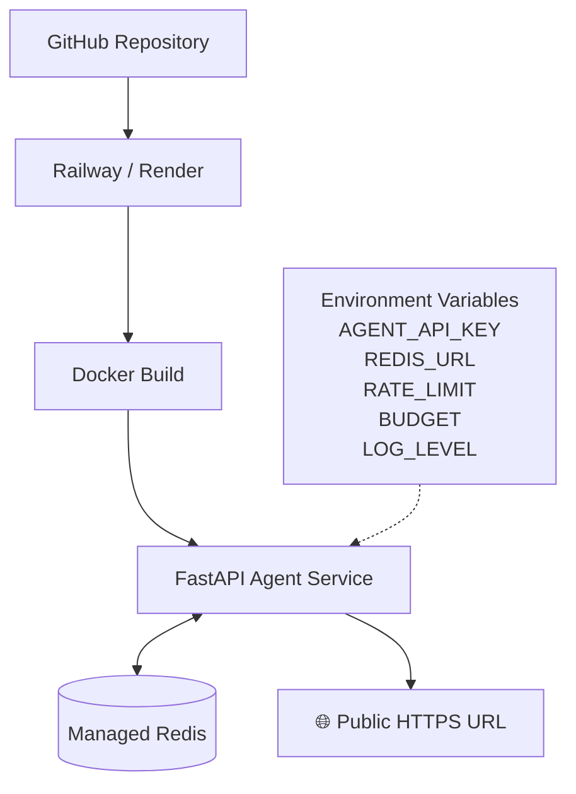

---

# 12.2 Phương án Railway theo lab

Cài CLI:

```bash
npm install -g @railway/cli
```

Đăng nhập:

```bash
railway login
```

Khởi tạo project:

```bash
railway init
```

Tạo Redis:

```bash
railway add --database redis
```

Set variable:

```bash
railway variables --set AGENT_API_KEY=<your-key>
```

Và các biến:

```text
RATE_LIMIT_PER_MINUTE=10
MONTHLY_BUDGET_USD=10.0
LOG_LEVEL=INFO
```

Redis add-on phải cung cấp:

```text
REDIS_URL
```

Không nên ghi đè `PORT` nếu platform tự cấp.

Deploy:

```bash
railway up
```

Tạo domain/public URL:

```bash
railway domain
```

Log:

```bash
railway logs
```

---

# 12.3 Phương án Render theo lab

Repo đã có `render.yaml`.

Luồng:

```text
Push GitHub
→ Render
→ New / Blueprint
→ chọn repository
→ Render đọc render.yaml
→ nhập AGENT_API_KEY
→ tạo Web Service + Redis
→ build Docker image
→ deploy
```

Trong `render.yaml`:

```yaml
- key: AGENT_API_KEY
  sync: false
```

có nghĩa secret không nằm trong repo.

---

# 12.4 Bắt buộc kiểm tra public deployment

Giả sử:

```bash
URL=https://your-public-domain
```

## Liveness

```bash
curl -i $URL/health
```

Kỳ vọng:

```text
200
status = ok
```

## Readiness

```bash
curl -i $URL/ready
```

Kỳ vọng:

```text
200
status = ready
redis = true
```

Nếu `/ready` = 503:

```text
kiểm tra REDIS_URL
kiểm tra Redis instance
kiểm tra network/credentials
```

## Security

Không gửi key:

```bash
curl -i -X POST $URL/ask \
  -H "Content-Type: application/json" \
  -d '{"question":"Hello"}'
```

Kỳ vọng:

```text
401
```

Có key:

```bash
curl -i -X POST $URL/ask \
  -H "Content-Type: application/json" \
  -H "X-API-Key: $AGENT_API_KEY" \
  -H "X-User-Id: sv-test" \
  -d '{"question":"Deploy là gì?"}'
```

Kỳ vọng:

```text
200
```

---

# 12.5 Điền `DEPLOYMENT.md`

Phải hoàn thiện:

```text
Họ tên
Mã học viên
Repo
Public URL
Platform
Ngày deploy
Danh sách environment variables
Kết quả curl
Ảnh screenshot
```

Không để lại:

```text
(điền ...)
TODO
<URL>
your-app
example.com
```

### Không leak secret

Được viết:

```text
AGENT_API_KEY — đã set trong dashboard
```

Không viết:

```text
AGENT_API_KEY=abc123-real-secret
```

---

# 12.6 Screenshot

Repo yêu cầu:

```text
screenshots/dashboard.png
screenshots/health.png
```

Nên chụp thêm:

```text
screenshots/ready.png
screenshots/ask-401.png
screenshots/ask-200.png
```

để dễ chứng minh bài hoạt động.

---

# 12.7 Local fallback

Nếu không deploy cloud được:

`.env`:

```dotenv
LOCAL_FALLBACK=true
```

Chạy:

```bash
docker compose up -d
```

Test:

```bash
pytest tests/test_cp5.py -v
```

Khi fallback, CP5 chỉ đạt tối đa 60% phần điểm này theo quy định bài lab.

---

# 12.8 Checkpoint 5

```bash
pytest tests/test_cp5.py -v
```

Nếu muốn test đường authenticated public API, đặt local:

```dotenv
DEPLOY_API_KEY=<key-của-service-đã-deploy>
```

File `.env` vẫn không được commit.

Commit:

```bash
git add DEPLOYMENT.md screenshots/
git commit -m "Checkpoint 5 - cloud deployment"
git push
```

---

# 13. BONUS — CI/CD với GitHub Actions

Mục tiêu:

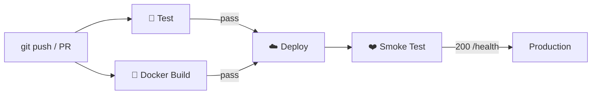

Quy tắc:

```text
Deploy chỉ chạy khi Test + Build đều pass.
```

---

# 13.1 Tạo workflow

Tạo:

```text
.github/workflows/ci.yml
```

Khung tham khảo:

```yaml
name: CI/CD

on:
  push:
    branches: [main]
  pull_request:
    branches: [main]

jobs:
  test:
    runs-on: ubuntu-latest

    steps:
      - name: Checkout
        uses: actions/checkout@v4

      - name: Setup Python
        uses: actions/setup-python@v5
        with:
          python-version: "3.11"

      - name: Install dependencies
        run: |
          python -m pip install --upgrade pip
          pip install -r requirements.txt

      - name: Run tests
        env:
          AGENT_API_KEY: ci-dummy
          REDIS_URL: fake://
        run: |
          pytest tests/ -v \
            --ignore=tests/test_cp5.py \
            --ignore=tests/test_bonus_cicd.py

  build:
    runs-on: ubuntu-latest

    steps:
      - name: Checkout
        uses: actions/checkout@v4

      - name: Build Docker image
        run: |
          docker build -t day12-agent:ci .

  deploy:
    needs: [test, build]

    if: github.ref == 'refs/heads/main' && github.event_name == 'push'

    runs-on: ubuntu-latest

    steps:
      - name: Checkout
        uses: actions/checkout@v4

      # Thay bước dưới đây bằng lệnh deploy phù hợp Railway/Render.
      - name: Deploy
        run: |
          echo "Deploy using platform secret"

      - name: Smoke test
        run: |
          sleep 45
          curl -fsS "${{ vars.PUBLIC_URL }}/health"
```

---

# 13.2 GitHub Secrets

Vào:

```text
Repository
→ Settings
→ Secrets and variables
→ Actions
```

Secret ví dụ:

```text
RAILWAY_TOKEN
```

Public variable:

```text
PUBLIC_URL
```

Trong YAML:

```yaml
${{ secrets.RAILWAY_TOKEN }}
${{ vars.PUBLIC_URL }}
```

Không viết token thật vào workflow.

---

# 13.3 Badge

Đầu `README.md`:

```markdown

```

Sau khi push:

```bash
pytest tests/test_bonus_cicd.py -v
```

---

# 14. Hướng dẫn làm `exercises.md`

Bài có 10 câu và yêu cầu trả lời dựa trên **quan sát thật khi chạy code**.

Không nên viết trước khi thực nghiệm.

## Câu 1 — Fail fast

Ghi lại:

```text
Thiếu AGENT_API_KEY
→ Settings ValidationError
→ service không boot
```

Giải thích vì sao điều đó tốt hơn secret mặc định.

---

## Câu 2 — Structured log

Hãy lấy một log thật:

```json
{"event":"ask_completed", ...}
```

Rồi phân tích khả năng:

- filter theo `user_id`;
- sum `cost_usd`;
- alert theo `level`;
- thống kê request;
- query theo timestamp.

---

## Câu 3 — Kích thước image

Cần ghi số đo thật.

Nên giữ Dockerfile ban đầu tạm trong file khác, ví dụ:

```text
Dockerfile.single
```

Build:

```bash
docker build -f Dockerfile.single -t agent:single .
docker build -t agent:multi .
docker images
```

Không bịa MB.

---

## Câu 4 — Docker cache

Sửa một ký tự trong:

```text
app/main.py
```

Build lại:

```bash
docker build -t agent:multi .
```

Quan sát layer nào:

```text
CACHED
```

và layer nào chạy lại.

---

## Câu 5 — Non-root

Giải thích chuỗi:

```text
bug/RCE
→ attacker chạy command trong container
→ nếu container root thì quyền bên trong rất cao
→ nếu có thêm container/host misconfiguration thì impact lớn hơn
```

`USER appuser` giảm quyền của process.

---

## Câu 6 — Sliding window

Thực nghiệm/giải thích case biên:

```text
10 requests lúc 10:00:59
10 requests lúc 10:01:01
```

Fixed-window có thể cho 20 request trong khoảng 2 giây.

---

## Câu 7 — Rate limit vs Cost guard

Phân biệt:

```text
Rate limit = request/time
Cost guard  = money/month
```

Tự đưa ví dụ thực tế.

---

## Câu 8 — `/health` vs `/ready`

Mô tả theo sequence:

```text
Redis down
→ readiness fail
→ LB ngừng gửi traffic
→ app process vẫn sống
```

Nếu gộp Redis vào liveness:

```text
Redis down
→ health fail
→ orchestrator restart tất cả instance
→ outage lớn hơn
```

---

## Câu 9 — Stateless

Chạy nhiều instance hoặc mô phỏng hai `ConversationStore` cùng Redis.

Quan sát:

```text
history_length
```

phải vẫn tăng nhất quán.

---

## Câu 10 — Deploy thật

Phải ghi một lỗi **bạn thật sự gặp**.

Ví dụ nhóm lỗi cần quan sát:

```text
Docker build fail
health timeout
REDIS_URL sai
PORT sai
environment variable thiếu
```

Ghi:

```text
error message
→ cách tìm nguyên nhân
→ cách sửa
→ kết quả sau sửa
```

---

# 15. Các mã HTTP trong bài

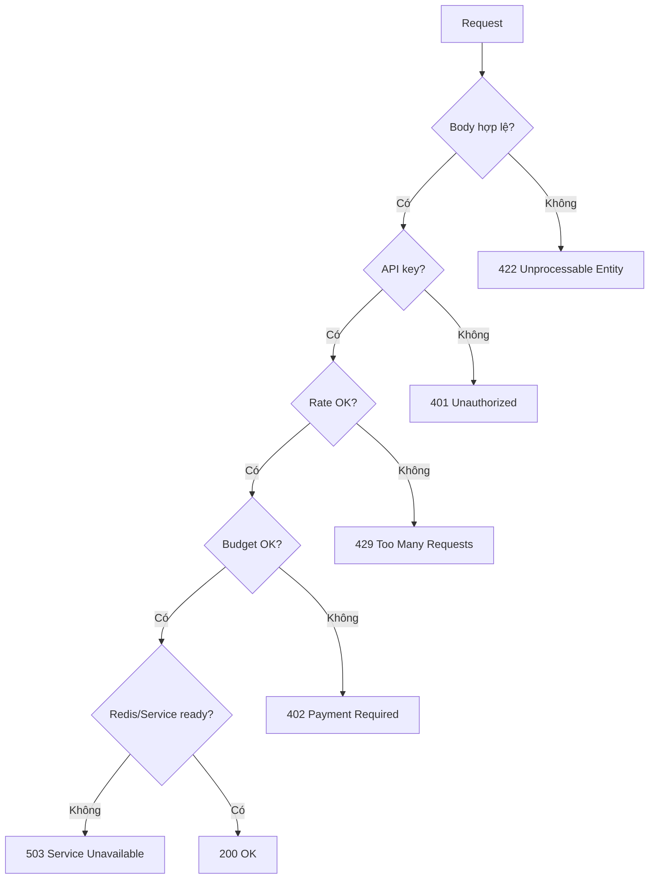

| Code | Ý nghĩa trong lab |
|---:|---|
| 200 | request thành công |
| 401 | API key thiếu/sai |
| 402 | vượt budget |
| 422 | body validation lỗi |
| 429 | vượt rate limit |
| 503 | không ready hoặc shutting down |

---

# 16. Trình tự thực hiện tối ưu

Không nên code tất cả rồi mới test.

Làm theo vòng lặp:

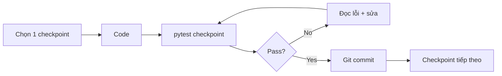

Thứ tự:

```text
CP0
 ↓
CP1
 ↓
CP2
 ↓
CP3
 ↓
CP4
 ↓
CP5
 ↓
exercises.md
 ↓
grade.py
 ↓
BONUS
```

Không nên nhảy CP3 trước CP1 vì CP3 phụ thuộc `Settings`.

Không nên deploy CP5 trước khi CP2/CP4 chạy ổn vì cloud deployment phụ thuộc Dockerfile, health/readiness và Redis.

---

# 17. Bộ lệnh kiểm tra nhanh

## Tất cả test

```bash
pytest tests/ -v
```

## Bỏ Docker test

```bash
pytest tests/ -v -m "not docker"
```

## Một checkpoint

```bash
pytest tests/test_cp3.py -v
```

## Dừng lỗi đầu tiên

```bash
pytest tests/test_cp3.py -x --tb=short
```

## Filter test

```bash
pytest tests/test_cp3.py -v -k rate
```

---

# 18. Bộ lệnh Docker hữu ích

Build:

```bash
docker build -t day12-agent:prod .
```

Image size:

```bash
docker images day12-agent:prod
```

Run stack:

```bash
docker compose up -d
```

Status:

```bash
docker compose ps
```

Logs:

```bash
docker compose logs -f agent
```

Shell vào container:

```bash
docker compose exec agent sh
```

Dọn stack:

```bash
docker compose down
```

Dọn cả volume:

```bash
docker compose down -v
```

---

# 19. Debug theo triệu chứng

| Triệu chứng | Nguyên nhân thường gặp | Cách xử lý |
|---|---|---|
| `ValidationError: agent_api_key Field required` | thiếu `.env` hoặc `AGENT_API_KEY` | tạo `.env`, set key |
| `Connection refused Redis` | Redis chưa chạy | `docker compose up -d redis` |
| `ModuleNotFoundError: app` | chạy test sai thư mục | chạy từ root repo |
| Container start rồi stop | env/config lỗi | `docker compose logs agent` |
| Curl container fail | bind `127.0.0.1` | dùng `0.0.0.0` |
| Image > 500 MB | base image nặng / một stage | slim + multi-stage |
| Build không cache | `COPY . .` quá sớm | requirements trước source |
| 429 quá sớm | add request trước count | count trước, add sau |
| `/ready` luôn 200 | không dùng `ping()` | check `store.ping()` |
| `/ready` 503 trên cloud | `REDIS_URL` sai | kiểm tra env/dashboard |
| Cloud health timeout | không đọc `$PORT` | `${PORT:-8000}` |
| Secret xuất hiện trong Git | `.env` từng được add | remove tracking + rotate key |

---

# 20. Nếu lỡ commit `.env`

Kiểm tra:

```bash
git ls-files .env
```

Nếu đã bị track:

```bash
git rm --cached .env
```

Đảm bảo `.gitignore` có:

```gitignore
.env
```

Commit:

```bash
git add .gitignore
git commit -m "Stop tracking env file"
```

**Quan trọng:** nếu secret thật đã từng push lên GitHub, việc xóa file ở commit mới **không làm secret cũ biến mất khỏi Git history**.

Cần:

```text
1. rotate/revoke secret cũ
2. sinh secret mới
3. chỉ lưu secret mới ở local/cloud secret manager
```

---

# 21. Kiểm tra final trước khi nộp

```bash
python grade.py
```

Mục tiêu nên đạt:

```text
CP1 PASS
CP2 PASS
CP3 PASS
CP4 PASS
CP5 PASS
10/10 exercises
```

Checklist:

- [ ] tên repo đúng `DAY12-2A202601137-LeManhCuong`;
- [ ] repo public;
- [ ] có nhiều commit theo checkpoint;
- [ ] không còn `NotImplementedError` trong `app/`;
- [ ] `pytest tests/ -v` đã chạy;
- [ ] `python grade.py` đã chạy;
- [ ] `.env` không nằm trong Git;
- [ ] không hardcode API key;
- [ ] Docker image build được;
- [ ] image nhỏ hơn khoảng 500 MB;
- [ ] container chạy non-root;
- [ ] `/health` hoạt động;
- [ ] `/ready` hoạt động;
- [ ] `/ask` không key trả 401;
- [ ] rate limit trả 429 đúng lúc;
- [ ] cost guard hoạt động;
- [ ] conversation history nằm trong Redis;
- [ ] `DEPLOYMENT.md` không còn placeholder;
- [ ] `DEPLOYMENT.md` không chứa secret thật;
- [ ] có Public HTTPS URL hoặc Local Fallback;
- [ ] có screenshots;
- [ ] `exercises.md` đủ 10 câu;
- [ ] BONUS workflow chạy xanh nếu làm.

---

# 22. Kiến trúc cuối cùng sau khi hoàn thiện

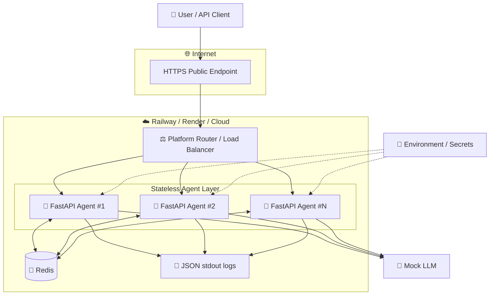

Hệ thống cuối cùng thể hiện các nguyên tắc production quan trọng:

```text
12-Factor configuration
+ immutable Docker image
+ least privilege
+ authentication
+ rate limiting
+ cost protection
+ externalized state
+ liveness/readiness
+ graceful shutdown
+ horizontal scalability
+ automated tests
+ cloud deployment
+ CI/CD
```

---

# 23. Những file bạn thực sự phải tập trung sửa

```text
app/
├── config.py          # CP1
├── logging_utils.py   # CP1
├── main.py            # CP1 + CP3 + CP4
├── auth.py            # CP3
├── rate_limiter.py    # CP3
├── cost_guard.py      # CP3
├── store.py           # CP4
└── lifecycle.py       # CP4

Dockerfile             # CP2
.dockerignore          # CP2
docker-compose.yml     # CP2

DEPLOYMENT.md          # CP5
exercises.md           # 15 điểm

.github/workflows/
└── ci.yml             # BONUS
```

Không cần sửa logic Mock LLM:

```text
utils/mock_llm.py
```

Nginx đã được cho sẵn để tham khảo/load balancing:

```text
nginx/nginx.conf
```

---

# 24. Lộ trình ngắn gọn để bắt đầu ngay

```text
Bước 1
Đổi tên repo đúng quy định.

Bước 2
Tạo .venv + cài requirements + tạo .env.

Bước 3
Chạy pytest để xác nhận CP0.

Bước 4
Hoàn thiện config.py + logging_utils.py + /health.
→ pass CP1.

Bước 5
Hoàn thiện Dockerfile + .dockerignore + compose.
→ pass CP2.

Bước 6
Hoàn thiện auth + rate limiter + cost guard + /ask.
→ pass CP3.

Bước 7
Hoàn thiện Redis conversation store + /ready + lifecycle.
→ pass CP4.

Bước 8
docker compose up và test end-to-end local.

Bước 9
Deploy Railway hoặc Render.
→ điền DEPLOYMENT.md + screenshots.
→ pass CP5.

Bước 10
Trả lời exercises.md dựa trên kết quả chạy thật.

Bước 11
python grade.py.

Bước 12
Nếu còn thời gian, làm GitHub Actions BONUS.
```

---

## Nguồn yêu cầu trong repository

- `README.md`
- `LAB_GUIDE.md`
- `tests/test_cp1.py`
- `tests/test_cp2.py`
- `tests/test_cp3.py`
- `tests/test_cp4.py`
- `tests/test_cp5.py`
- `tests/test_bonus_cicd.py`
- `app/*.py`
- `Dockerfile`
- `docker-compose.yml`
- `.env.example`
- `DEPLOYMENT.md`
- `exercises.md`
- `railway.toml`
- `render.yaml`
- `nginx/nginx.conf`

Repository:

```text
https://github.com/lemanhcuong6904/K3-Day12-2A202601137-LeManhCuong
```
